# Radiation

A Fallout-style radiation mod for **Minecraft 26.3** (Fabric).

Admins mark out irradiated zones and place radiation sources. Players who walk into one get a red
**rad meter** in the top left corner showing how many RAD/s they are absorbing, hear a Geiger counter
clicking, and pass through stages of radiation sickness until they die at 1000 rads.

Online handbook: https://mchamradio.antwire.net/handbook/radiation/

## Installing with Prism Launcher

1. In Prism, create a new instance (**Add Instance**), choose Minecraft **26.3**, and pick **Fabric**
   as the mod loader (any recent loader version, at least 0.19.5).
2. Open the instance's **Edit → Mods** page and click **Download mods**. Search for **Fabric API** and
   install it. Radiation needs it.
3. Click **Add file** and pick `radiation-1.7.1.jar`, or drop the jar onto the mod list.
4. Start the instance.

For a multiplayer server, put the same jar plus Fabric API into the server's `mods` folder. Every
player needs the mod installed as well.

## How it works

| Accumulated rads | Default stage                 | Effects                                              |
|------------------|-------------------------------|------------------------------------------------------|
| 250              | Mild Radiation Sickness       | Hunger, −1 heart                                     |
| 500              | Radiation Sickness            | Hunger, Weakness, −2 hearts                          |
| 750              | Severe Radiation Sickness     | Hunger II, Weakness II, Slowness, Mining Fatigue, −4 hearts |
| 1000             | Death ("died of radiation poisoning") |                                              |

Rads don't wear off on their own (as in Fallout). You need RadAway, or you have to die. They reset on death.

### The rad meter

- **☢ RADS** with the current rate on the right. It pulses red while you take radiation and turns
  green while RadAway is flushing rads out.
- A segmented red bar from 0 to the maximum, with a coloured tick at each sickness stage.
- Absorbed / maximum rads, your current protection (**RES %**), and the name of your sickness stage.
- It appears when you are irradiated or treated and fades out a few seconds later. Holding a Geiger
  counter always shows it. It hides while the F3 debug screen is open.

### Items

| Item | What it does | Recipe |
|------|--------------|--------|
| **Geiger Counter** | Right-click for a detailed reading: ambient radiation, what you absorb, protection, condition. Holding it shows the meter. | Copper ingot (top right), iron / glass pane / iron, yellow dye / redstone / yellow dye |
| **RadAway** | Removes 150 rads over 10 seconds | Shapeless: glass bottle + dried kelp + glow berries + sugar |
| **Rad-X** | Blocks 50% of incoming radiation for 4 minutes | Shapeless: paper + amethyst shard + sugar + orange dye → 2 |
| **Hazmat Hood / Suit / Trousers / Boots** | Each piece blocks 22.5% (full set 90%) | Shaped like leather armor, using leather and yellow wool (the hood has a glass pane visor) |
| **Nuclear Waste Barrel** | A block that radiates its surroundings (6 rad/s, radius 6 by default). It glows and drips green particles. Creative/admin only. | none |

Protection from armor and Rad-X stacks, capped at 95% by default.

Solid blocks between you and a **point source** absorb radiation. By default each block removes 35%,
so hiding behind a thick wall helps. Zones are uniform and can't be shielded against.

## Vault blocks

Version 1.2.0 adds everything you need to build a Fallout-style fallout shelter.

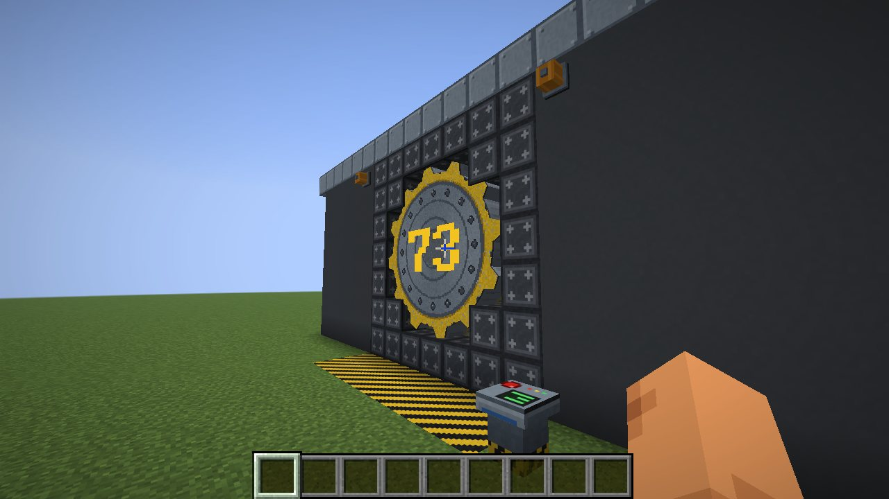

| Block | What it does |
|-------|--------------|
| **Vault Door** | The big cog door for a round 5×5 opening. Place it in the middle of the opening, facing the outside. A **screw arm** behind it extends, screws into the cog, pulls it back into the vault and lets go; the cog then rolls aside. Closing runs the other way. An alarm klaxon sounds the whole time. It is blast-proof. |
| **Vault Door Console** | A pedestal with a big button: opens or closes the nearest vault door within 16 blocks. A vault door also toggles on a redstone pulse. |
| **Vault Alarm Light** | A rotating amber warning light. It spins and lights up while a vault door within 16 blocks opens or closes. Mount it on any wall, floor or ceiling. |
| **Vault Sliding Door** | A two-block steel door that slides up into the wall above it. Doors standing side by side in the same wall open together, so you can build wider doorways. Opens by hand or redstone. |
| **Vault Wall Panel**, **Striped Vault Wall Panel**, **Vault Pipe Panel** | Riveted steel walls: plain, with the blue and yellow stripe, and with pipes. |
| **Vault Floor Plate**, **Vault Floor Grate** | Tread plate and see-through grating. |
| **Hazard Stripes**, **Vault Door Frame** | Yellow and black warning stripes; heavy frame blocks for the door opening. |
| **Vault Light Panel**, **Blue / Yellow / White Neon Tube** | Flat light panels and neon tubes for walls, floors and ceilings. |

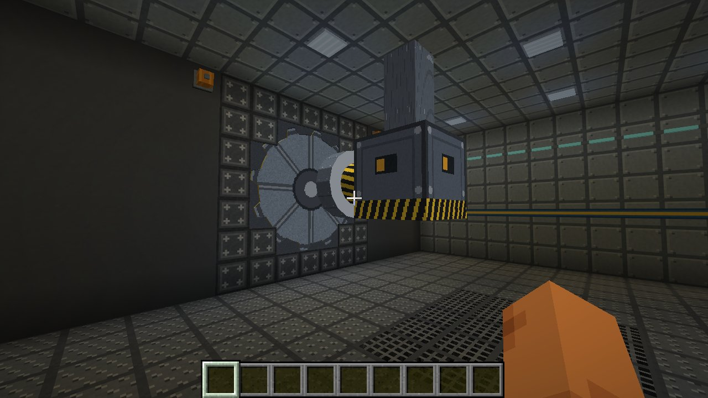

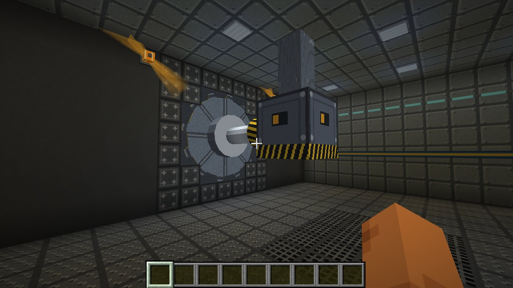

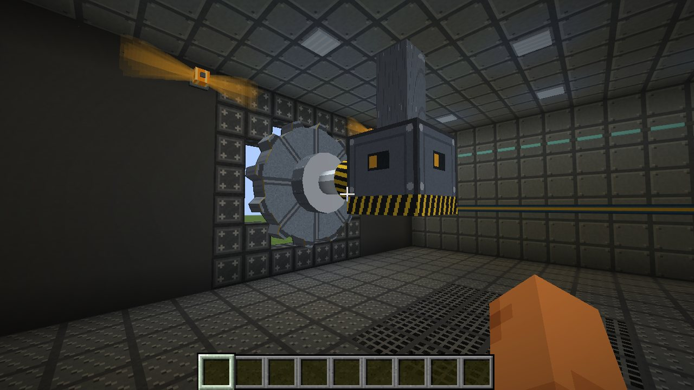

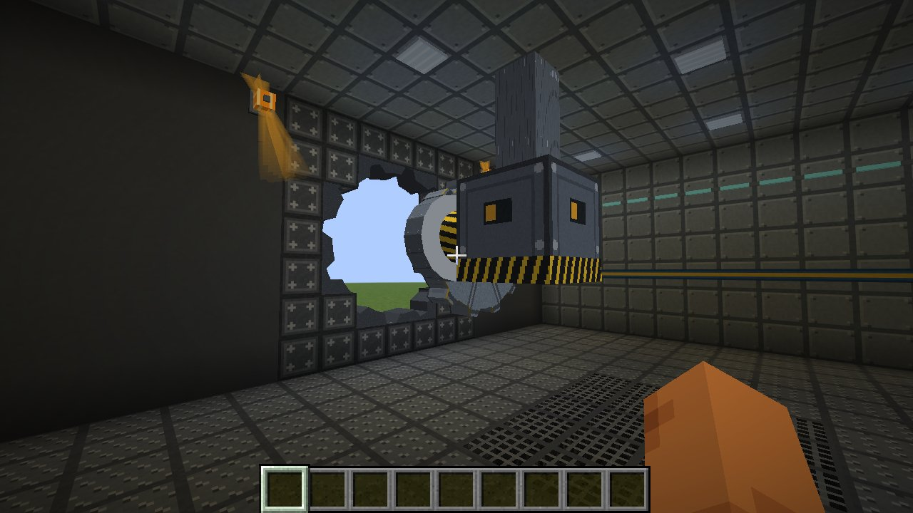

**Room the door needs.** The door is 5 blocks across. Behind it (inside the vault) keep the space clear: **7 blocks deep** for the screw arm, **4 blocks above the door's centre** for the arm's ceiling mount, and **8 blocks to the side** the door rolls to. Corners of the 5×5 square stay solid; use Vault Door Frame blocks there.

**Number and roll direction.** Sneak and use the door to set the number painted on it (0 to 999) and which side it rolls to. Only operators and players in creative mode can do this.

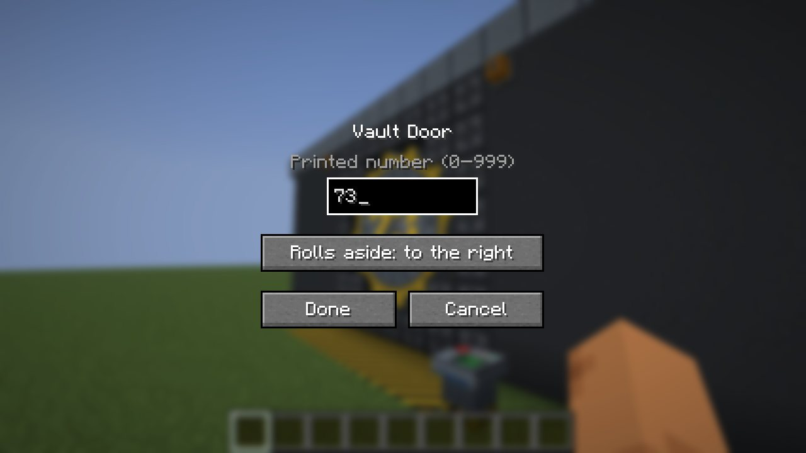

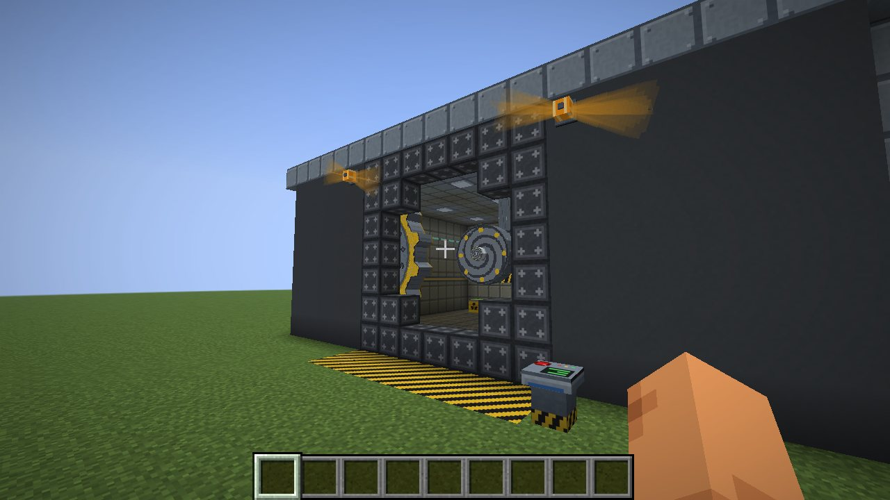

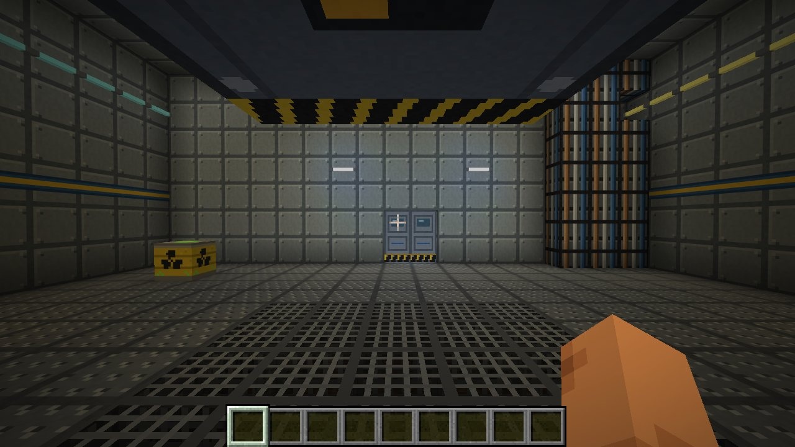

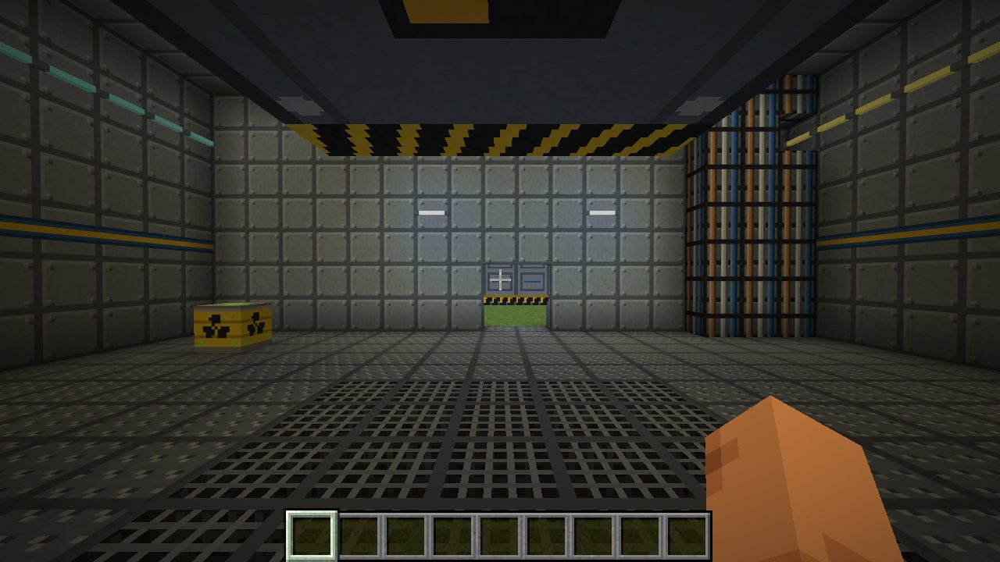

### Vault recipes

| Item | Recipe |
|------|--------|
| Vault Door | 8 iron blocks around a redstone block |
| Vault Door Console | Stone button on top, glass pane / redstone / glass pane, 3 iron ingots |
| Vault Alarm Light | Glowstone dust, orange stained glass pane / redstone / orange stained glass pane, iron ingot |
| Vault Sliding Door ×2 | 5 iron ingots and a piston (iron, iron / piston, iron / iron, iron) |
| Vault Wall Panel ×8 | 8 smooth stone around an iron ingot |
| Striped Vault Wall Panel ×2 | 2 wall panels, yellow dye, blue dye |
| Vault Pipe Panel | Wall panel and a copper ingot |
| Vault Floor Plate | Wall panel and grey dye |
| Vault Floor Grate ×4 | 4 iron bars |
| Hazard Stripes | Wall panel, yellow dye, black dye |
| Vault Door Frame ×4 | 2 iron ingots and 2 obsidian, diagonally |
| Vault Light Panel ×2 | Iron nugget, glowstone, iron nugget |
| Neon Tube ×2 | Glass pane, glowstone dust and blue, yellow or white dye |

## Concrete and shielding

Shielding depends on the material. Every block between a radiation source and you absorbs a fraction of
the radiation:

| Material | Absorbs per block | Left after 3 blocks |
|---|---|---|
| **Heavy Concrete**, iron/gold/netherite blocks, obsidian, vault doors | 97 % | 0.003 % |
| **Reinforced Concrete**, all coloured concrete, vault walls | 90 % | 0.1 % |
| Other solid blocks | 35 % | 27 % |
| Water | 30 % | 34 % |
| Air, glass panes, leaves and other see-through blocks | nothing | |

Concrete shields reliably (since 1.4.0; before it let 45 % through each block): each block takes away 90 %,
so a wall a few blocks thick stops practically everything. Measured in the test world, an emitter of
1000 rad/s at one metre, 6 m away: 26.8 rad/s in the open, 2.7 behind one block of concrete, 0.27 behind
two, 0.027 behind three, 0.0027 behind four. (Real concrete is better still: a metre of it lets through
about 1/10,000 of fission-product gamma rays.)

| Block | Recipe | |
|---|---|---|
| **Reinforced Concrete** | 8 gray concrete around 1 iron ingot → 8 | Blast resistance 1200 (like obsidian): explosions do not break it |
| **Heavy Concrete** | 5 reinforced concrete + 4 raw iron → 5 | Blast resistance 1200, the best shielding |

Both need a diamond pickaxe. They are the material for bunkers, vaults and reactor buildings (the
Fission mod's reactors cannot blow through enough of them). The tags `radiation:shielding_concrete`
and `radiation:shielding_heavy` let data packs and other mods add their own blocks.

## What radiation does to the land

Since 1.4.0 radiation damages plants, soil and animals, not only players. Everything depends on the dose
rate at the spot, so concrete, water and earth protect a field exactly as they protect you.

| Dose rate (default) | What happens |
|---|---|
| 0.01 rad/s | Crops, saplings, melons, pumpkins, berries, sugar cane, cactus, bamboo and nether wart grow at half speed |
| 0.1 rad/s | ...at a tenth of their speed (in between it changes gradually) |
| 0.3 rad/s | Leaves die and fall: trees stand bare |
| 1 rad/s | Crops, flowers, grass, ferns and saplings die; dead bushes are left where they can stand |
| 2 rad/s | Grass, podzol, moss and farmland die back to bare dirt |
| 25 rad/s | Dirt of every kind turns to sand: nothing lives in the soil any more |
| 0.01 rad/s | Animals and villagers take up rads exactly like players (since 1.6.0): the same sickness stages and effects (hunger from 250, weakness from 500, slowness from 750), the same share of their health lost, dead at 1000. Undead do not care. |

Is that realistic? Roughly, but plants are slower to show it than here: 0.01 rad/s is 8.6 Gy a day, which
stunts grain within days; pines at Chernobyl (the Red Forest) died after a few hundred gray, grasses and
herbs take several times more. A rate of 1 rad/s (36 Gy an hour) kills most plants within a day.

| A source of 40 rad/s after a while | Wheat at 0.3, 0.1 and 0 rad/s, same time |
|---|---|
| 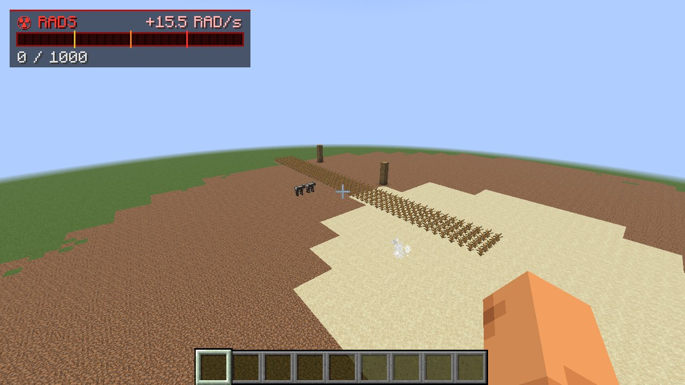 | 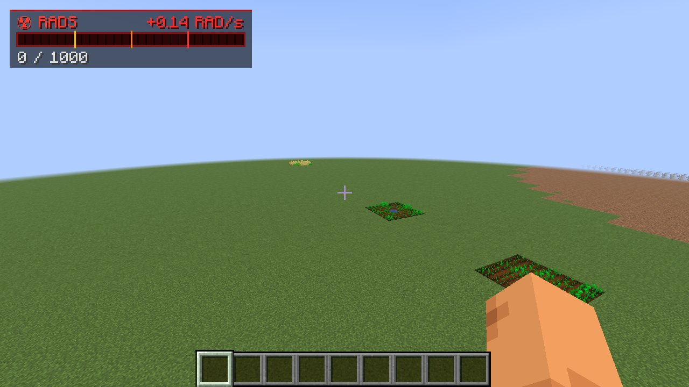 |

Only the land near radiation is looked at, a few surface blocks per chunk every second, so it costs little
and changes come over a few minutes rather than at once. All thresholds are in the config (`ecology`).

## Contaminated food

Since 1.7.0 **every food has a contamination**: the rads you take up when you eat it. The tooltip shows it in red right
under the name - **+30 rad** - on every contaminated food, and on what food is made of (wheat, sugar, eggs, milk,
pumpkins... the item tag `radiation:contaminable`); clean food shows nothing. Armour and Rad-X do not help: what you eat is inside you.

Food gets contaminated
- **in the field**: a crop takes up the radiation of the ground it grows on. What a harvest carries depends on the dose
  rate at the plant when it is harvested: 20 rad per item for every rad/s. Wheat from a field at 0.5 rad/s: 10 rad a
  sheaf. Seeds stay clean. The same goes for berries, apples from leaves, melons, pumpkins, cocoa, mushrooms, sugar cane.
- **in the animal**: meat, eggs and the like from an irradiated animal carry a tenth of its rads: a cow with 400 rads
  gives steaks at 50 rad.
- **in storage**: food kept in a chest, barrel, furnace, hopper... or lying on the ground where it is irradiated takes up
  0.005 rad per item for every rad it is exposed to: an hour at 1 rad/s makes 18 rad. **Food in your inventory takes up
  nothing more** - carry it out of the zone.
- **by processing**: what is made of contaminated food is contaminated too. Crafting shares the contamination of all
  ingredients out over the result - three sheaves of wheat at 10 rad bake a loaf at 30 rad - and cooking keeps it: a raw
  steak at 50 rad is a cooked steak at 50 rad.

Harvests and products are rounded to a few steps (0.1, 0.2, 0.3, 0.5, 1, 2, 3, 5, 10, 20...) so that they stack.

| Contaminated bread | ...and a steak from an irradiated cow |
|---|---|
| 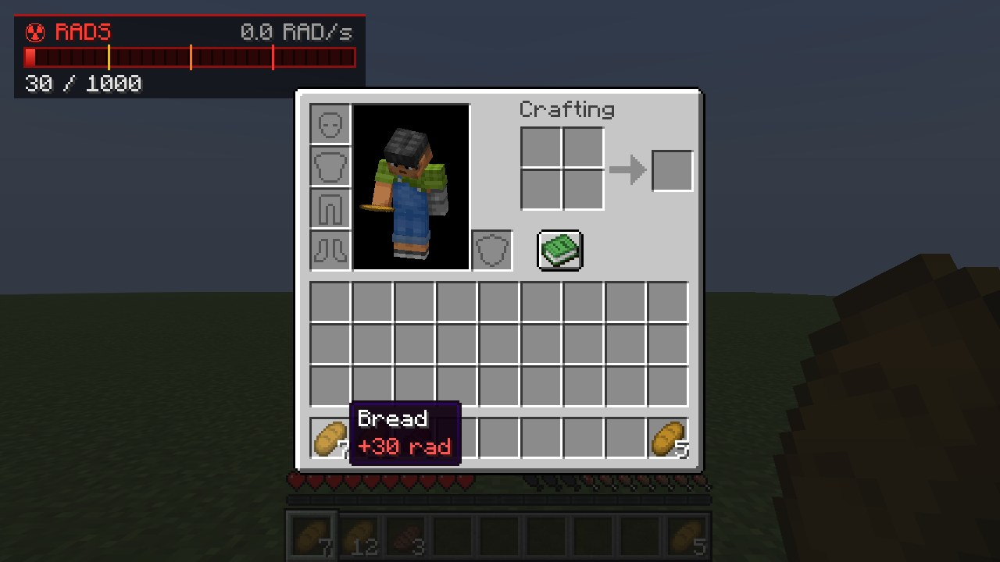 | 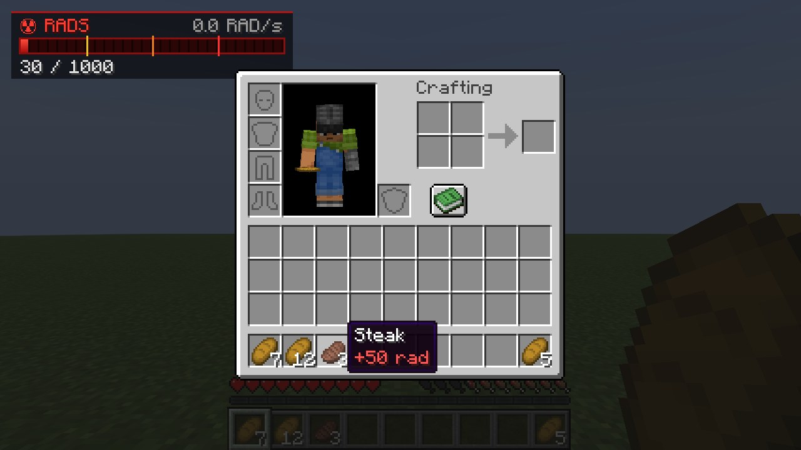 |

In a test: wheat from a field at 0.53 rad/s was 10 rad a sheaf and the bread baked from it 30 rad; two raw steaks at 50
rad came out of a furnace as two cooked steaks at 50 rad; a minute next to a 1.9 rad/s source made the bread in a chest,
the wheat beside it and an apple on the ground 5.8 rad each (with 10 times the normal uptake), while the bread in the
player's inventory stayed clean; eating a 30 rad loaf took the player from 0 to 30 rads.

## Radioactive clouds, wind and rain

Since 1.5.0 radioactivity can travel: a burning reactor core ([Fission](https://github.com/Lamisator/fission)), a
nuclear detonation ([RedButton](https://github.com/Lamisator/mc_redbutton)) or an operator's
`/radiation cloud <pos> <rad/s> [radius] [altitude]` releases a **radioactive cloud**. It rises high into the sky (by default 110 blocks above the
ground, a nuclear detonation's up to 375; it climbs another 80 as it drifts) and drifts with the wind, spreading as it goes. The ground under it gets its radiation (people indoors are
shielded by their roofs), and it leaves **fallout** behind: sources that fade like iodine-131 (half-life 8 days)
except for about 15 % that stays like caesium-137. Fallout that lands in the same 48-block square adds up into one
source. A dry cloud fades away when it has spread too thin, after several kilometres, or after two hours.

**Since 1.6.0 clouds last much longer and contaminate much more** (all of it in the config, `clouds`): a cloud spreads
half as fast, lives up to two hours and leaves five times the fallout. In a test, a 3 rad/s cloud (wind 10 m/s) was
still 1.2 rad/s strong 490 blocks downwind in dry weather and left a trail of fallout up to 25 rad/s; the same cloud in
rain was washed out to 0.1 rad/s within 500 blocks and left fallout up to 85 rad/s near where it rained out.
Fallout also lands on the ground where nobody is near (1.5 could leave it hanging at the height the cloud started).

**Rain washes clouds out.** Where it rains (or snows) under a cloud, it drops its fallout four times as often and
five times as heavily per block (`clouds.rainFactor`), so it is gone after a few hundred blocks - and leaves hot spots where it rained, as
Chernobyl's fallout did. In a test, two equal clouds after 200 blocks: the dry one still 1.5 rad/s under it, its
hottest fallout 5 rad/s; the one in rain 0.5 rad/s, its fallout up to 14 rad/s.

**The wind** has no Minecraft equivalent, so it is made up, the same for everyone: each world has a prevailing
direction (from its seed) that swings back and forth over the days, 3 to 6 m/s, more in rain and thunderstorms.
`/wind` tells everyone where it blows. Clients draw clouds (and smoke columns, such as a burning reactor's) up to a
kilometre away, within their render distance.

## Commands

`/rads` works for every player and shows your own rads and condition.

The rest need operator permission (or cheats enabled in singleplayer):

| Command | Description |
|---------|-------------|
| `/radiation zone add <name> <from> <to> <rads/s> [fade]` | Box-shaped area with a uniform radiation level. `fade` makes it ramp up over that many blocks from the edge. |
| `/radiation source add <name> <pos> <rads/s> <radius> [falloff] [shielded]` | Point source that weakens with distance. Falloff: `linear` (default), `quadratic`, `inverse_square`, `constant`. `shielded` (default `true`) controls whether walls block it. |
| `/radiation zone remove <name>` / `/radiation source remove <name>` | Remove a zone or source (tab-completes names) |
| `/radiation list` (or `zone list` / `source list`) | List everything |
| `/radiation show [seconds]` | Draws zones (green), sources (red) and barrels (yellow) with particles. `0` turns it off. |
| `/radiation check [pos]` | Radiation level at a position, broken down by zone/source |
| `/radiation get <player>` | Show a player's rads |
| `/radiation set <players> <amount>` / `add <players> <amount>` | Change rads (negative `add` removes) |
| `/radiation clear [players]` | Reset rads to 0 |
| `/radiation reload` | Reload the config and the sources file |
| `/radiation cloud <pos> <rads/s> [radius] [altitude]` | Release a radioactive cloud (default 12 blocks wide, 110 up) |
| `/radiation clouds` | The clouds on their way, and whether they are raining out |
| `/radiation wind [set <towards°> <m/s> \| natural]` | Show the wind, fix it (0° = north, 90° = east) or let it change again |
| `/wind` | Where the wind blows (for everyone) |

Examples:

```
/radiation zone add crater 100 50 100 160 90 160 15 5
/radiation source add reactor ~ ~1 ~ 40 20 quadratic
/radiation show 60
```

Zones and sources are saved per world in `<world folder>/radiation_sources.json`. You can also edit
that file by hand and then run `/radiation reload`.

## Configuration

Every value is configurable. The files are created on first start in the instance's `config` folder.
In Prism, that's **Edit → Minecraft folder → config**.

**`config/radiation.json`**: gameplay (on a server, the server's copy applies):

| Setting | Default | |
|---------|---------|-|
| `maxRads` | 1000 | Rads at which you die. The meter's scale. |
| `stages` | 250 / 500 / 750 | List of stages: `threshold`, `name`, `color` (ARGB hex), `maxHealthModifier` (half-hearts), `effects` (any effect id + `amplifier`, 0 = level I). Add, remove or rename freely. |
| `naturalDecayPerSecond` | 0 | Rads lost per second without treatment |
| `updateIntervalTicks` | 10 | How often radiation is calculated (20 = once per second) |
| `affectCreativeAndSpectator` | false | |
| `shieldingPerBlock` | 0.35 | Fraction removed by each solid block between a point source and you |
| `concreteShielding`, `heavyShielding`, `waterShielding` | 0.90, 0.97, 0.30 | The same for concrete, heavy shielding and water. Files from older versions with the old defaults (0.55, 0.75) are upgraded on load; values changed by hand stay. |
| `barrelRads`, `barrelRadius` | 6, 6 | Nuclear Waste Barrel strength |
| `protectiveItems` | hazmat pieces at 0.225 | Any item id → protection when worn. You can add other mods' armor here. |
| `radXResistance` | 0.5 | |
| `maxProtection` | 0.95 | Set to 1.0 to allow full immunity |
| `radAwayTotalRads` | 150 | |
| `radAwayDurationSeconds`, `radXDurationSeconds` | 10, 240 | Need a restart |
| `requireGeigerCounter` | false | If true, the RAD/s readout and the clicking only work while you carry a Geiger counter |
| `ecology.enabled` | true | Radiation changes the land (see above) |
| `ecology.cropSlowdownRads`, `ecology.cropGrowthAtSlowdown` | 0.01, 0.5 | From this rate crops grow at this fraction of their speed... |
| `ecology.cropStuntRads`, `ecology.cropGrowthWhenStunted` | 0.1, 0.1 | ...and from this rate at this fraction |
| `ecology.leafDeathRads` | 0.3 | Leaves die |
| `ecology.plantDeathRads` | 1.0 | Crops, flowers, grass, ferns and saplings die |
| `ecology.grassToDirtRads` | 2.0 | Grass, podzol, moss and farmland turn to dirt |
| `ecology.soilToSandRads` | 25.0 | Dirt turns to sand |
| `ecology.animalsTakeRads` | true | Animals and villagers take up rads exactly like players (from 0.01 rad/s): the same sickness stages and effects, the same share of their health lost, death at `maxRads` |
| `food.enabled` | true | Food carries contamination and eating it gives rads |
| `food.cropUptake` | 20 | Rad per harvested item for each rad/s at the plant |
| `food.animalShare` | 0.1 | Share of an animal's rads in each piece of meat (egg...) it gives |
| `food.storageUptake` | 0.005 | Rad per item for each rad of exposure in a container or on the ground |
| `food.storageIntervalTicks` | 100 | How often stored food is looked at |
| `clouds.maxAgeMinutes` | 120 | The longest a radioactive cloud drifts |
| `clouds.spreadPerBlock` | 0.012 | How much wider it gets per block (wider = thinner); 1.5 had 0.025 |
| `clouds.fadedRads` | 0.001 | A cloud is gone when the dose rate under it falls below this |
| `clouds.falloutFactor` | 5.0 | All fallout multiplied by this (1 = as in 1.5) |
| `clouds.rainFactor` | 5.0 | Rain: this many times as much fallout per block |
| `clouds.rainWashout` | 20.0 | Rain: the cloud is used up this many times as fast per block |
| `ecology.intervalTicks`, `ecology.samplesPerChunk`, `ecology.changeChance` | 20, 4, 0.5 | How often, how many surface blocks per chunk near radiation, and the chance a block above a threshold changes each time: higher is faster |

**`config/radiation-client.json`**: per-player display settings:

| Setting | Default | |
|---------|---------|-|
| `hudX`, `hudY`, `hudScale` | 6, 6, 1.0 | Position and size of the meter |
| `hudMode` | `EXPOSURE` | `EXPOSURE` (Fallout-like), `NONZERO` (whenever you have rads), `ALWAYS`, `HIDDEN` |
| `hudLingerSeconds` | 4 | How long the meter stays after exposure ends |
| `showWhileHoldingGeiger` | true | |
| `geigerVolume` | 0.6 | 0 mutes the clicks |
| `geigerClicksPerRad`, `geigerMaxClicksPerSecond` | 2.5, 60 | How busy the Geiger counter sounds |

## For mod developers

Other mods can use `dev.radiation.api.RadiationApi` (server side) to add and remove point sources, read the radiation at a position, and add rads to players, with or without their protection. [RedButton](https://github.com/Lamisator/mc_redbutton) uses it to irradiate ground zero after nuclear detonations.

Since 1.3.0, `setEmitter(level, pos, radsAtOneMetre, radius)` makes a block radiate: its strength at one metre falls off
with the square of the distance and is absorbed by the blocks in between. Emitters are saved with the world and dropped
when their block changes. `transmission(level, from, to)` gives the fraction that gets through between two points.
[Fission](https://github.com/Lamisator/fission) uses these for reactor cores, spent fuel, storage and corium.

Since 1.5.0 `releaseCloud(level, pos, strength, radius, altitude)` releases a radioactive cloud (see above),
`smokeColumn(level, key, foot, width, height, ticks)` shows a column of smoke, and `wind(level)` gives the wind.

Since 1.4.0 point sources can decay: `addSource(..., halfLifeTicks, longLivedFraction)` makes a source that halves
every `halfLifeTicks` game ticks except for a part that stays (fallout: iodine fades, caesium stays), and that is removed
by itself once it is down to nothing. `updateSource(level, name, pos, rads, radius)` moves a source, e.g. a drifting
cloud. Fission's radioactive clouds and fallout use both.

## Building from source

Requires JDK 25.

```
./gradlew build
```

The mod jar ends up in `build/libs/radiation-1.7.1.jar`. `./gradlew runClient` starts a development
client with the mod loaded. `./gradlew runClientGameTest` runs the vault screenshot tour,
`./gradlew runClientGameTest -Pscene=ecology` the land, crop and shielding test.
`./gradlew runClientGameTest -Pscene=food` the contaminated food test (harvest, bread, meat, furnace, storage, eating, tooltips).

`tools/gen_assets.py` regenerates the textures and sounds (needs Pillow, numpy and soundfile, plus
the vanilla textures extracted from the Minecraft client jar).
